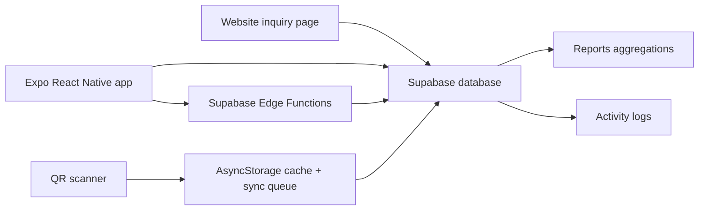

# Architecture

How the app is built: runtime stack, navigation and state, the UI/design system, project layout, the Supabase backend, and the release process.

## High-Level Picture



## Runtime Stack

- Expo SDK 51 / React Native 0.74, plain JS under `src/` (no TypeScript beyond `expo/tsconfig.base`).
- React Navigation v7 (bottom tabs + stack).
- Supabase JS client (anon key only) for auth, database, Edge Functions, and realtime.
- AsyncStorage for session persistence, active challan, local challan cache, and the QR sync queue.
- `react-native-safe-area-context` (`SafeAreaProvider` at the root; all safe-area padding comes from insets).
- `react-native-chart-kit` + `react-native-svg` for report charts.
- A secondary Firebase Firestore (`src/config/firebaseConfig.js`) is used **only** for lightweight usage counters (`analyticsService`) — it is not part of the data layer.

## Provider Tree And Navigation

```
App.js
└── ErrorBoundary
    └── SafeAreaProvider
        └── RefreshBusProvider          (pub/sub for cross-screen refetch)
            └── AuthProvider            (Supabase auth + profiles roles)
                └── ChallanProvider     (offline-first challans + sync queue)
                    └── NavigationContainer
                        └── RootNavigator (Stack: Login | MainApp)
                            └── MainTabNavigator (custom BottomNav "squeeze-rail"; tabs = groups)
                                └── NavProvider (sub-tab + expanded state)
                                    └── TabGroupScreen (renders the active sub-tab screen)
                                        └── Screen (from SCREEN_MAP)
```

**Navigation is data-driven** via `src/config/roleTabs.js` — the single most important file for access control:

1. **Groups** (`ROLE_GROUPS`) = bottom tabs. Each group is one `Tab.Screen`.
2. **Sub-tabs** (`ROLE_TABS`) = shown inside the **custom bottom bar** (`src/components/BottomNav.js`), passed to `Tab.Navigator` via its `tabBar` prop — there is no top segment control anymore.

`App.js` calls `getVisibleGroupsForRoles(roles)` to build the bar; `SCREEN_MAP` maps each `TAB_KEY` to its screen component. Users can hold multiple roles (`profiles.roles` array); access is the union across roles. The `SHOW_PURCHASES_MODULE` feature flag gates the Purchases module. **Screens are NOT registered as navigator routes** — only group keys exist as routes; sub-tab switching happens through `NavContext` (`useNav().setSubTab`) and, for child screens jumping siblings, `useTabGroup().navigateToTab`.

**Bottom bar behavior:** in Browse state all groups show as icon+label. Tapping a multi-sub-tab group enters Focus — the other groups are **hidden** and the group's sub-tabs fill the bar as a **segmented control** (spring-driven sliding indicator) beside the active-group pill; tapping the pill collapses back to Browse. Single-sub-tab groups (Purchases, Inquiries, Profile) never expand. Animated with `react-native-reanimated` (`FadeIn` layer swap + a shared-value `withSpring` indicator that slides between sub-tabs); haptics via `expo-haptics`; respects OS reduce-motion. The bar keeps `position: absolute` so screens still self-pad via `useResponsiveLayout().scrollBottomPadding`. Sub-tab + expanded state live in `src/context/NavContext.js`.

Groups: Production (Production Output, Raw Material, Power) · Sales (Scanner, Details, Challans) · Manage (Users, Logs, Reports) · Purchases · Inquiries · Profile.

## Auth And Session (`src/context/AuthContext.js`)

- Supabase email/password login; profile, primary `role`, `roles[]`, `disabled`, and `full_name` come from `profiles`.
- Profile fetch retries (`fetchProfileWithRetry`); a failure fails the login instead of creating a role-less session.
- Disabled/deleted users are force-logged-out; `last_login` is updated on a heartbeat while active.

## Cross-Screen Refresh — Three Coordinated Mechanisms

Screens reload data via `useRefreshOnFocus(refreshFn, deps, domain, refreshSignal)` (`src/hooks/useRefreshOnFocus.js`), which triggers on **any** of:

1. **Navigation focus** (`useIsFocused`).
2. **`refreshSignal`** — `TabGroupScreen` passes an incrementing prop to the active sub-tab when the group is focused or the sub-tab is switched.
3. **Refresh bus** (`src/context/RefreshBusContext.js`) — after a mutation, call `emitRefresh(domain)`; subscribed screens refetch. Domains in use: `challans`, `reports`, `production`, `raw_materials`, `purchases`, `power`, `users`.

When adding a screen that shows server data, wire it through `useRefreshOnFocus` and emit the relevant domain after writes.

## Offline-First Challans (`src/context/ChallanContext.js` + `src/services/storage.js`)

QR scanning must feel instant and work offline:

- Active challan id lives in AsyncStorage (`@active_challan_id`); challans are cached locally.
- Scans update local state synchronously (a `challansRef` mirror avoids dropped boxes on back-to-back scans), persist via a debounced (700 ms) write-behind buffer, and enqueue to `@challan_sync_queue`, which flushes to Supabase on app-state changes and a 20 s interval. **Never block the scan UI on network.**
- The same QR is deduped for 3 s; a scan lock guards alert flows.
- Delete is **soft delete** (`status = 'deleted'`). Non-admins see departed challans only for departure day + 2 days; admins see all.
- Challan list fetch is bounded by `CHALLAN_FETCH_LIMIT = 3000` (PostgREST caps unbounded selects at 1000 silently).
- Camera lifecycle: `ScannerScreen` computes `cameraActive = permission && isFocused && appState === 'active'` and passes it to `CameraView active=` — bottom tabs never unmount screens, so this is what stops the camera on tab switch/backgrounding.

## UI / Design System

All 14 screens follow one system (introduced in the July 2026 UI overhaul):

**Theme tokens** — `src/theme/` (barrel: `src/theme/index.js`):

- `colors.js`: full 50–950 color ramps, semantic colors, `gradients.header` (the only sanctioned gradient outside tab icons), borders.
- `radii.js`: `xs 6 … xxl 24, pill 999` (unscaled).
- `responsive.js`: `textSizes` (tiny 10 … display 40), `spacingSizes` (xs 4 … huge 48), `iconSizes` (xs 14 … hero 48), `sizes` (headerHeight, inputHeight, touchTarget, tabBarBase, chipHeight), `shadows`. Scaling uses `min(width, height)` capped at 1.25× so cold-start orientation and tablets don't inflate fonts/spacing; these values are static at module load — **layout** reacts to rotation, not typography.
- `typography.js`, `spacing.js`, `animations.js`: thin/legacy layers.

**Layout hook** — `src/hooks/useResponsiveLayout.js` is the single source of truth for layout decisions: `{ width, height, isTablet (min(w,h) ≥ 600), isLandscape, columns (1/2/3), contentMaxWidth (760 on tablets), horizontalPadding, tabBarHeight, scrollBottomPadding, insets }`. Never use module-scope `Dimensions.get('window')`, core RN `SafeAreaView`, or `Platform.OS` padding constants.

**Shared components** — `src/components/`:

- `ScreenHeader`: the one screen title bar (slim gradient, title/optional subtitle/icon/right action; still supports `chips` but operational screens no longer pass them). Applies its own top safe-area inset — `useTabGroup().hasSegmentBar` is retained but always `false` now that sub-tabs moved to the bottom bar, so there is no segment bar above to consume the inset.
- `BottomNav`: the custom "squeeze-rail" bottom navigation bar (see the navigation section). `TabGroupScreen`: renders the active sub-tab screen for a group and exposes `useTabGroup()` (`navigateToTab`, `hasSegmentBar`).
- `AppTextInput`: labeled input with error/helper text and `forwardRef` for keyboard focus-chaining (`returnKeyType="next"` → `nextRef.current?.focus()`, last field submits).
- `AppModal`: modal shell — bottom sheet on phones, centered card on tablets — with built-in keyboard avoidance and safe-area padding.
- `Chip` / `FilterPills`: selectable pills that **wrap**; never a horizontal ScrollView.
- `StatCard`: flat KPI tile with tonal icon badge for grid layouts.
- `DataTable`: fit-to-width table; columns declare `priority (1–3)` — phones show priority ≤ 2 and row-tap opens a labeled detail modal; tablets show all. Never scrolls horizontally.
- `EmptyState`, `DateRangeSelector` (Reports range control incl. custom from–to), `DateNavigator` (prev/next day bar), `InlineBanner`, `SectionDivider`, `ShiftStatusBadge`, `AnimatedButton`/`Button`, `AnimatedCard`/`Card`, `GradientBackground`, `GradientCard`, `ResponsiveText`, `ManualEntryModal`, `ErrorBoundary`, `TabGroupScreen`.

**Grids**: FlatList `numColumns` changes require `key={numColumns}` (RN constraint). Tablet grids use `columns` from the hook.

## Project Layout

```
App.js                  Root providers, tab navigator, SCREEN_MAP, inquiry badge
app.json / eas.json     Expo + EAS build config (android/ and ios/ are gitignored — CNG prebuild)
src/
  components/           Shared UI (see above)
  config/               supabase.js (client), roleTabs.js (access map), firebaseConfig.js (counters only)
  context/              AuthContext, ChallanContext, RefreshBusContext
  hooks/                useRefreshOnFocus, useResponsiveLayout
  models/               Challan, ScannedItem (status, computed totals, JSON ↔ object mapping)
  screens/              14 screens (one per sub-tab plus Login/Splash)
  services/             One service per domain — productionService, productionOutputService,
                        reportService, purchaseService, logService, authService, backupService,
                        sessionService, suggestionService (all Supabase); analyticsService (Firebase counters)
  theme/                colors, radii, responsive, typography, spacing, animations + index barrel
  utils/                dateOnly, reportDates, qrParser, excelExport, pdfExport
supabase/
  functions/            create-user, update-user-password, backup-export
  migrations/           20260324_unique_visitors_and_shift_rls.sql (see backend note below)
website/                index.html, inquiry.html, theme.js, styles.css, script.js, assets/
docs/                   FEATURES.md, ARCHITECTURE.md, EXTRA_DETAILS.md, reports_verification.sql
```

Notable utils:

- `dateOnly.js`: date-only helpers that avoid timezone drift — `getTodayIST()`, `dateToISTDateString()`, `toDateOnlyString`/`fromDateOnlyString` (exact round-trip), `addDaysToDateOnly`. Shift/report "today" is always the IST business day; pickers stay device-local.
- `reportDates.js`: report range presets and labels. Presets include `CUSTOM_DATE:YYYY-MM-DD` and `CUSTOM_RANGE:YYYY-MM-DD:YYYY-MM-DD`; timestamp tables use `toKolkata{Start,End}OfDayISO` bounds.

Screens call services, not the Supabase client directly. Every auditable action logs via `logService.logEvent` (namespaced keys: `challan.*`, `production.shift.*`, `power.cut`, `user.*`, `backup.create`, …).

## Supabase Backend

Client: `src/config/supabase.js` — URL `https://kwsubbcefpmzbctgtjnu.supabase.co`, anon key only, AsyncStorage session persistence, `autoRefreshToken`/`persistSession` true. **The service-role key must never appear in app or website code** — it lives only in Edge Function env vars.

### Tables

| Table | Purpose |
| --- | --- |
| `profiles` | App user profile, primary role, roles array, disabled status, full name, last login. |
| `challans` | Sales challans, scanned item JSON, status, soft delete fields, departed timestamp. |
| `activity_logs` | Auditable app actions across modules. |
| `raw_material_types` | Admin/GM-manageable raw material names and active flag. |
| `raw_material_entries` | Daily shift raw material usage with material JSON, created/ended metadata. |
| `production_product_types` | Product definitions for stretch, bubble, pouch, and baby output. |
| `production_shifts` | Daily production shift shells and shift end/restart state. |
| `production_outputs` | Output rows linked to production shifts and product types. |
| `purchase_entries` | Raw material purchases (UI flag-gated). |
| `power_events` | Power cut and power in events with occurrence timestamp. |
| `website_inquiries` | Website enquiry form submissions and status management. |
| `website_visits` | Website visit analytics with stable visitor IDs. |
| `site_config` | Website theme/config values. |

Verified DB constraints: `challans_number_active_uq` (unique challan number where status ≠ deleted); unique `(shift_date, shift_type)` on `production_shifts` and `raw_material_entries`; unique `(shift_id, product_id)` on `production_outputs`.

### RPCs / Functions

- `website_unique_counts(today_start, week_start)`: distinct visitor counts and top cities.
- `restart_raw_material_shift(entry_id uuid)` / `restart_production_shift(shift_id uuid)`: Admin/GM-only restart of ended shifts (SECURITY DEFINER, verified to check `is_admin() OR is_general_manager()` internally).
- `is_admin()`, `is_general_manager()`: policy helpers.

### RLS Intent

- Admin can see/manage all operational data.
- Production Manager reads/writes production and raw material shift data per flow.
- General Manager can view production/raw data, end shifts, and restart via RPC.
- Sales Manager can access challan modules.
- Website inquiry/visit inserts are allowed from the public website.
- Logs are admin-visible in UI.

**Important:** only one migration is checked in (`supabase/migrations/20260324_...sql`). Much of the schema/RLS was applied out-of-band via Supabase MCP, so local migrations are **not** a complete schema source of truth.

### Edge Functions (`supabase/functions/`)

| Function | Purpose |
| --- | --- |
| `create-user` | Admin-only user creation. Verifies caller JWT + admin role + not disabled; creates the auth user via service role; inserts matching `profiles` row. Called by `authService.createUser()`. |
| `update-user-password` | Admin-only password reset via `auth.admin.updateUserById`. Called by `authService.updateUserPassword()`. |
| `backup-export` | Admin-only ZIP export of all tables — `csv/{table}.csv` + `supabase/{table}.json` + auth users + `manifest.json` + `restore.js`. Keep its table list updated when adding a new persistent table. Limitation: Supabase never exports password hashes; restoring users requires a temporary-password/reset flow. |

### Reports Data Sources (`reportService.js`)

Reports read raw tables and aggregate client-side; every query is capped at `REPORT_ROW_LIMIT = 10000`.

- **Production**: `production_shifts` + `production_outputs`, grouped by `shift_date`, day+night combined. Stretch/Bubble use units and total weight; Pouch uses pieces; Baby uses units.
- **Raw materials**: `raw_material_entries` grouped by `shift_date`; labels from `raw_material_types` with fallback to names stored in entries.
- **Sales**: `challans` where `status = 'departed'`; date is `status_changed_at` (fallback `created_at`); totals count challans, boxes, pieces, gross weight.
- **Power**: `power_events` grouped by IST occurrence date; downtime from chronological cut/in pairs.
- **Purchases**: `purchase_entries` (flag-gated UI).
- **Stock** (separate path): `getStockBalance(targetDate)` → `{ hasPurchases, materials[] }` — cumulative Σ purchases(≤date) − Σ usage(≤date) over active materials.

A ground-truth SQL harness mirroring the app aggregation lives at `docs/reports_verification.sql`.

## Build, OTA Updates, And Release

```bash
yarn start                 # Expo dev server (Metro)
yarn android / yarn ios    # native run on device/simulator
yarn build:preview         # eas build -p android --profile preview   → APK
yarn build:production      # eas build -p android --profile production → APK
yarn update:preview        # eas update --channel preview             → OTA (JS only)
yarn update:production     # eas update --channel production          → OTA (JS only)
```

- Install with `yarn` (`.npmrc` sets `legacy-peer-deps=true`; `yarn.lock` committed). EAS profiles pin Node `20.11.1`.
- `android/` and `ios/` are gitignored (CNG prebuild).
- **OTA ships JS only.** Anything touching native config (`app.json` plugins/permissions/orientation, new native deps) requires a new `build:*`. The `runtimeVersion` in `app.json` must match between the installed binary and the update for OTA to apply (current: `1.1.1`).
- Update check is automatic on app launch (`checkAutomatically: "ON_LOAD"`); updates apply on next restart.
- EAS project: `e38f88a5-37ce-4cb4-b57c-12479156de35`, dashboard `https://expo.dev/accounts/rvg24/projects/aarti-polymers`. Useful: `npx eas update:list`, `npx eas channel:list`.
- Always test on the preview channel before production; rollbacks are managed from the EAS dashboard.

## Conventions Checklist (for any new work)

- Layout via `useResponsiveLayout()`; safe areas via insets; no `Dimensions.get` at module scope.
- Headers via `ScreenHeader`; inputs via `AppTextInput` with focus chaining; modals via `AppModal`; filters via `FilterPills`; tables via `DataTable`.
- Style from theme tokens (`colors`, `radii`, `textSizes`, `spacingSizes`, `iconSizes`, `sizes`, `shadows`) — no hardcoded values.
- Dates via `dateOnly.js` helpers; block future dates; iOS pickers apply on Done only.
- Every mutation: `logService.logEvent(...)` + `emitRefresh(domain)`.
- Data loading through `useRefreshOnFocus`.
- Screens call services, never the Supabase client directly.
